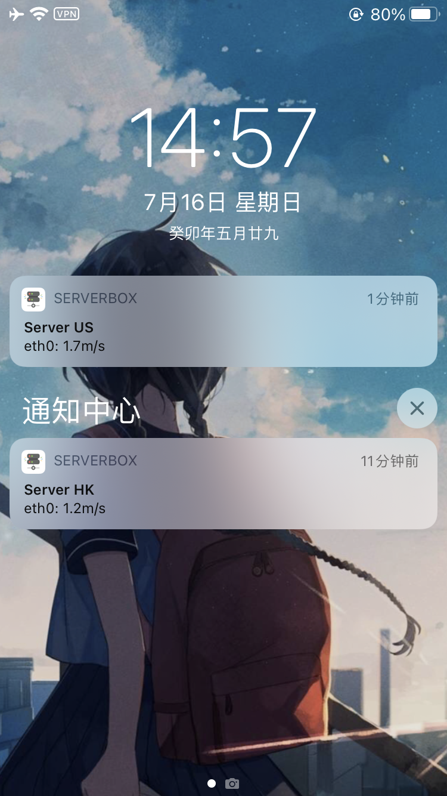
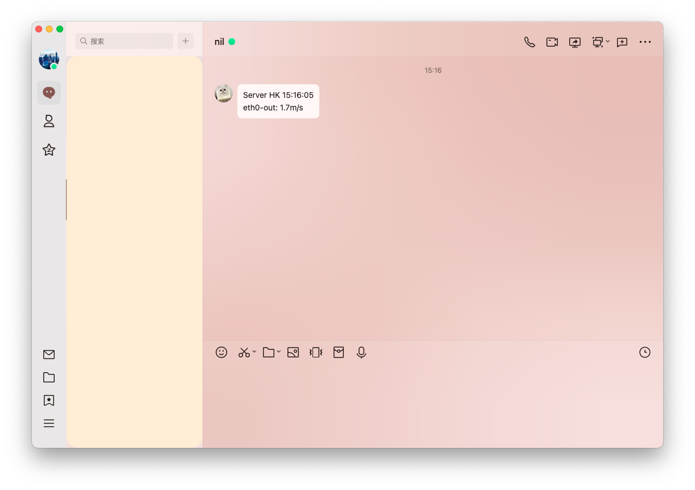

English | [简体中文](README_zh.md)

## ServerBox Monitor
This app runs on server end and monitors the server status.  
It is a part of [ServerBox](https://github.com/lollipopkit/flutter_server_box) project.  
**It's under active development, you may need to reconfig it after upgrading.**

## 🖥️ Screenshots
<table>
  <tr>
    <td>
	    <h5 align="center">iOS push</h5>
    </td>
    <td>
	    <h5 align="center">Webhook push (QQ)</h5>
    </td>
    <td>
	    <h5 align="center">iOS widget</h5>
    </td>
  </tr>
  <tr>
    <td>
	    
    </td>
    <td>
	    
    </td>
    <td>
	    
    </td>
  </tr>
</table>

## 📖 Usage
Please goto [Wiki](https://github.com/lollipopkit/server_box_monitor/wiki) for more information.

## 🔖 License
`GPL v3. lollipopkit 2023`